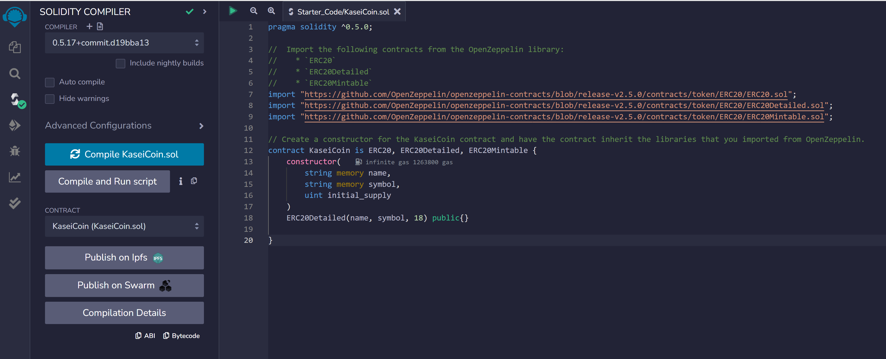
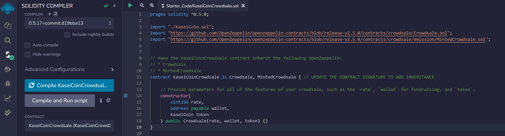
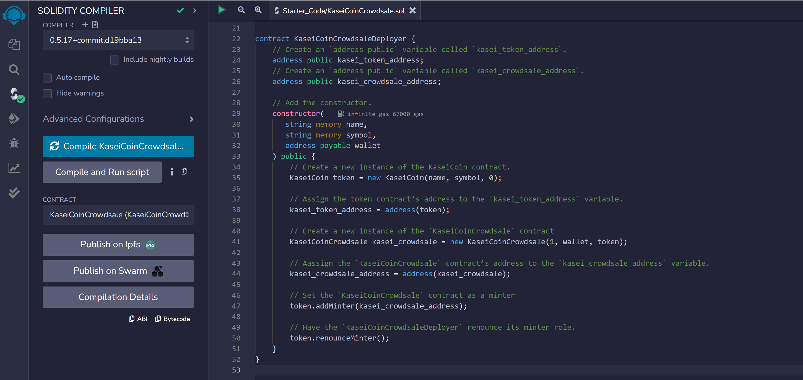

# KaseiCoin Crowdsale

## The project is create a fungible token called KaseiCoin to allow people who are moving to Mars to convert their earthling money to KaseiCoin.

### Step 1: Create the KaseiCoin token contract.
* Import `ERC20`, `ERC20Detailed`, and `ERC20Mintable` from the `OpenZeppelin` library.
* Define a contract for the KaseiCoin token called `KaseiCoin`, and have the contract **inherit** the three contracts imported from `OpenZeppelin`.
* Add a constructor with the following parameters: `name`, `symbol`, and `initial_supply`.
* Add a call to the ERC20Detailed contract’s constructor. Recall that `18` is the value for the decimal parameter.

### Step 2: Create the KaseiCoin crowdsale contract.
* Have this contract inherit the following `OpenZeppelin` contracts: `Crowdsale` and `MintedCrowdsale`.
* Within the KaisenCoinCrowdsale constructor, provide parameters such as `rate`, `wallet`, and `token`. 

### Step 3: Create the KaseiCoin deployer contract.
* Create an `address public` variable called `kasei_token_address`.
* Create an `address public` variable called `kasei_crowdsale_address`.
* Add the following parameters to the constructor for the KaseiCoinCrowdsaleDeployer contract: `name`, `symbol`, and `wallet`.
* Create the KaseiCoin token by using a new instance with parameters `name` and `symbol`, and by setting the initial_supply parameter to `0`.
* Assign the KaseiCoin token contract’s address to the `kasei_token_address` variable.
* Create a new instance using the following parameters: `rate`, `wallet`, `token`.
* Assign the KaseiCoin crowdsale contract’s address to the `kasei_crowdsale_address` variable.
* Set the `KaseiCoinCrowdsale` contract as a minter.
* Have the `KaseiCoinCrowdsaleDeployer` **renounce** its minter role.

### Step 4: Deploy the crowdsale to a local blockchain using Remix, MetaMask, and Ganache.
* Share a video

### Step 5: Evaluation Evidence - screenshots to show the deployed contract in action.

